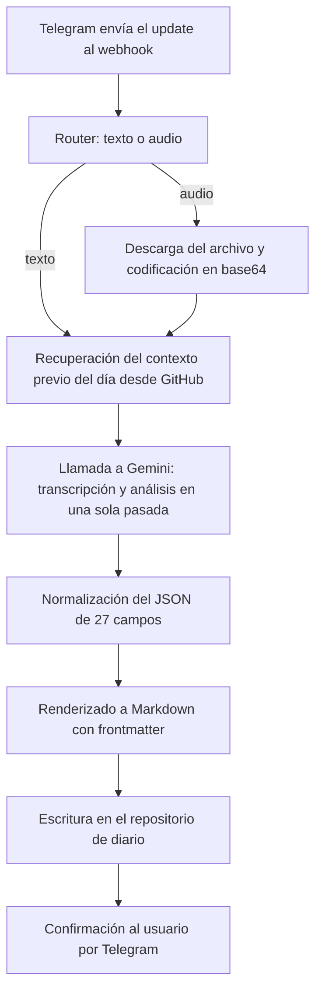

# Tele-diario

Bot de Telegram sin servidor que convierte una nota de voz en una entrada estructurada de diario dentro de un vault de Obsidian. Se manda un audio desde el móvil, Gemini lo transcribe y lo analiza en una sola llamada, y el resultado se sincroniza como Markdown en un repositorio de GitHub. Corre entero sobre Google Apps Script, así que no hay servidor que mantener ni coste de infraestructura.

En uso diario desde abril de 2026.

## Qué hace

- Procesa notas de voz y mensajes de texto desde un único webhook de Telegram.
- Extrae información estructurada con Gemini: emociones, energía, personas, lugares, eventos, tareas e insights.
- Mantiene la continuidad del día fusionando cada entrada nueva con el contexto de las anteriores.
- Genera Markdown compatible con Obsidian: frontmatter YAML, secciones narrativas y una instantánea JSON del estado acumulado.
- Sincroniza contra GitHub con reintentos y manejo de conflictos de SHA.
- Incluye un modo de entrada manual por chat y más de veinticinco comandos, varios de ellos de diagnóstico.

## Cómo funciona



La zona horaria es Europe/Madrid con la frontera del día puesta a las 12:00: los mensajes de madrugada se archivan en el día anterior, que es donde el autor los habría escrito.

## El prompt

Es la pieza central del proyecto, y está en `01_Config.js`. Obliga al modelo a devolver un JSON con veintisiete claves exactas y define:

- Reglas de fusión con el contexto previo del mismo día: qué arrays acumulan sin duplicar, qué campos se sobrescriben y cuáles se reescriben enteros.
- Diarización por hablante y etiquetas de tono entre corchetes dentro de la transcripción.
- Cuatro escalas numéricas de 1 a 5 (energía, estrés, calidad de la transcripción y confianza de la extracción) con el criterio explícito de cada nivel, para que la puntuación no dependa del humor del modelo.
- Un campo de razonamiento interno que no llega a la nota final.
- Una lista de verificación que el modelo tiene que recorrer antes de responder.

## Comandos

Generales: `/ayuda`, `/help`, `/start`, `/comandos`, `/nueva_entrada`, `/fin_entrada`, `/cancelar_entrada`, `/ping`, `/version`, `/estado`, `/fecha_logica`, `/ruta_hoy`, `/modelo_actual`, `/modelos`, `/ultimo_guardado`.

Cambio de modelo en caliente: `/modelo_flash`, `/modelo_lite`, `/modelo_pro`.

Diagnóstico y administración: `/debug_on`, `/debug_off`, `/test_conexion`, `/test_propiedades`, `/reset`. Algunos quedan restringidos a los chats de administración cuando `ADMIN_CHAT_IDS` está configurado.

## Stack

Google Apps Script, JavaScript, API de Telegram, API de Google Gemini, API Contents de GitHub y Obsidian como destino final. Modelo por defecto `gemini-3-flash-preview`, con `gemini-3.1-flash-lite-preview` y `gemini-3.1-pro-preview` disponibles por comando.

## Estructura del repositorio

Dieciséis módulos, ordenados por el flujo de ejecución.

| Archivo | Función |
| --- | --- |
| `01_Config.js` | Constantes globales, catálogo de modelos y prompt de sistema |
| `02_Main.js` | `doPost`, validación inicial y enrutamiento |
| `03_Estado.js` | Comandos, estado y permisos |
| `04_Modulos.js` | Pipeline de texto y de audio |
| `05_Telegram.js` | Capa de envío y descarga con la API de Telegram |
| `06_Gemini.js` | Llamada a Gemini y contrato de respuesta |
| `07_Github.js` | Lectura y escritura diaria en GitHub |
| `08_Formateador.js` | Orquestador de la transformación de la salida de IA a Markdown |
| `08_Formateador_Helpers.js` | Render de Markdown, fusión de datos y utilidades |
| `08_Formateador_Historial.js` | Instantánea JSON, historial de transcripciones y extractores de fecha y hora |
| `09_Utils.js` | Utilidades base, seguridad y configuración de ejecución |
| `09_Utils_EntradaManual.js` | Deduplicación y sesión temporal para la entrada manual |
| `09_Utils_Diagnostico.js` | Comprobaciones de propiedades y de conectividad |
| `10_Mensajes.js` | Base de mensajes y comandos |
| `10_Mensajes_Pipeline.js` | Mensajes de ejecución, errores y cierre del pipeline |
| `11_Logger.js` | Logger de pipeline para depuración |

## Instalación

Necesitas una cuenta de Google con acceso a Apps Script, un bot creado en BotFather, una clave de la API de Gemini, un token de GitHub con permiso sobre el repositorio de destino y un vault de Obsidian apuntando a ese repositorio.

Despliegue directo en Apps Script:

1. Crea un proyecto nuevo en Google Apps Script.
2. Copia los archivos JS del repositorio.
3. Despliégalo como aplicación web con acceso público, que es lo que permite recibir el webhook.
4. Rellena las Script Properties de la tabla de abajo.
5. Registra el webhook de Telegram apuntando a la URL desplegada.

```
curl "https://api.telegram.org/bot<TELEGRAM_TOKEN>/setWebhook?url=<WEBHOOK_URL_ENCODED>"
```

Con clasp, si prefieres trabajar en local:

```
npm install -g @google/clasp
clasp login
clasp clone <SCRIPT_ID>
clasp push
clasp deploy -d "Webhook Telegram"
```

## Configuración

Todo va en Script Properties, nunca en el código.

| Clave | Obligatoria | Descripción |
| --- | --- | --- |
| `TELEGRAM_TOKEN` | Sí | Token del bot de Telegram |
| `GEMINI_API_KEY` | Sí | Clave de la API de Gemini |
| `GITHUB_TOKEN` | Sí | Token de GitHub para lectura y escritura |
| `TELEGRAM_WEBHOOK_SECRET` | Recomendada | Secreto para validar que el webhook viene de Telegram |
| `ALLOWED_CHAT_IDS` | Recomendada | Lista de chats autorizados, separados por comas |
| `ADMIN_CHAT_IDS` | Recomendada | Lista de chats con acceso a comandos sensibles |
| `DEBUG_MODE` | No | Por defecto, `false` |
| `IA_MODEL` | No | Por defecto, `gemini-3-flash-preview` |
| `LAST_SYNC_ROUTE` | No | Última ruta sincronizada |
| `LAST_SYNC_MODE` | No | Último modo de sincronización |
| `LAST_SYNC_AT` | No | Última fecha y hora de sincronización |

## Seguridad

El diario que genera este bot es material personal, así que el repositorio de destino es privado y tiene que seguir siéndolo. Además:

- Mantén activo `TELEGRAM_WEBHOOK_SECRET`, que es lo que impide que cualquiera invoque el webhook.
- Define `ALLOWED_CHAT_IDS` para que el bot solo atienda a tus chats.
- Define `ADMIN_CHAT_IDS` para los comandos que reinician el estado.
- Limita el token de GitHub al repositorio concreto del diario, sin permisos de cuenta.
- Rota los tokens de vez en cuando y no publiques logs con payloads dentro.

## Diagnóstico

Si el bot no responde, comprueba que la aplicación web esté desplegada y accesible y que el webhook apunte a la URL correcta; `/test_conexion` valida las tres APIs de una vez. Si no guarda en GitHub, revisa el token y sus permisos y ejecuta `/test_propiedades` para detectar propiedades ausentes. Si falla Gemini, verifica la clave y cambia de modelo con `/modelo_flash` o `/modelo_lite`. No hay reintentos automáticos en la llamada al modelo, a propósito, para no gastar cuota por duplicado: reenvía el mensaje y ya está.

## Estado y mejoras previstas

El proyecto está en uso y sigue creciendo. Lo siguiente en la lista:

- Exportador de analítica de JSON a CSV para consultas históricas.
- Panel de métricas: emociones por persona y patrones semanales.
- Informes semanales y mensuales automáticos.

## Contacto

Gabriel Gómez García. [GitHub](https://github.com/Gabiz053) y [LinkedIn](https://www.linkedin.com/in/gabrielgomezgarcia/).

## Licencia

MIT. Ver [LICENSE](LICENSE).
